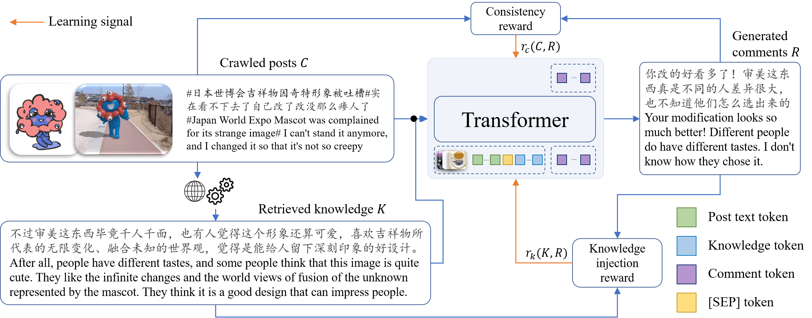

# Triplet-Free Knowledge-Guided Response Generation

This is the official repository of our ACL'23 paper *Triplet-Free Knowledge-Guided Response Generation*. It only contains training and evaluating codes of our English models. If you are looking for our multimodal IceKC dataset, please check it out at [here](https://github.com/dongmingli-Ben/IceKC).



## Requirements

Install the following packages
```
pytorch
torchvision
transformers
Pillow
pandas
mlflow
py-rouge
```

`mlflow` is optional for logging training process. If you do not want to install it, please refer to [the training script](#training) on how to disable mlflow in training.

And install nlgeval
```bash
pip install git+https://github.com/Maluuba/nlg-eval.git@master
```
Note that to calculate ROUGE score, please install java. For more information, please refer to [this link](https://github.com/Maluuba/nlg-eval).

### Conda Environment

We have exported our environment into `requirements.txt`. You may use

```bash
conda create --name <env> --file requirements.txt
```

to prepare the working environment.

## Data

Please refer to [data](data) for the training and testing data.

## Training

Use our training script to train models on WoW:

```bash
bash train_doc_eng.sh
```

Note that we use `mlflow` and `tensorboard` to log the training process in the provided script. To disable `mlflow` logging, remove the `--mlflow` argument in the training script. To disable `tensorboard`, remove `--tensorboard`.

If you are using `mlflow`, you need to first start a mlflow server so that metrics and parameters can be logged. Use the following command to start the mlflow server:

```bash
mlflow server --backend-store-uri sqlite:///mlrunsdb15.db --default-artifact-root mlruns
```

You need to keep the server running during the whole training process.

## Testing

Use our testing script to test models on WoW and WizInt datasets.

First, download our trained checkpoint from [Google Drive](https://drive.google.com/file/d/1azDZeBxVyAxe6eLos93ZaGcJ7rjEJLZ8/view?usp=drive_link) or choose one of your saved checkpoints.

Then set the path to the checkpoint in `test.sh` (line 2) and run

```bash
bash test.sh
```

## Citation

Coming soon.